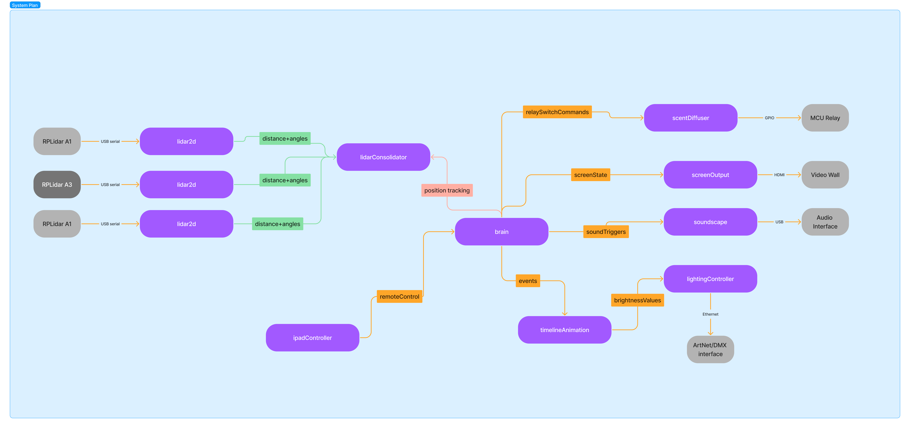

# Tether

Tether is a standardised way of using [MQTT](https://mqtt.org/) (for message publishing and subscribing) and [MessagePack](https://msgpack.org/index.html) (for serialised data in message payloads).

By using Tether, we can approach digital art/media installations as **distributed systems**, and apply a **Publish Subscribe pattern** and **event-based programming** to coordinate the independent pieces of software and hardware that commonly comprise these systems.

The Tether approach is about abstracting the underlying hardware and software so that everything from the point of view of the "system" is an **Agent** that can communicate using standardised **Messages**.

- [What defines a Tether system](#what-defines-a-tether-system)
  - [1. The MQTT Broker](#1-the-broker)
    - [Why Pub/Sub?](#why-pubsub)
    - [Why MQTT specifically?](#why-mqtt)
    - [Where is my Broker?](#where-is-my-broker)
    - [Performance considerations](#performance-considerations)
    - [Retained messages](#retained-messages)
  - [2. The Three Part Topic](2-the-three-part-topic)
    - [Role](#agent-role)
    - [ID or Group](#id-or-group)
    - [Plug Name](#plug-name)
    - [Putting it all together: Topic pattern matching](#putting-it-all-together-topic-pattern-matching)
  - [3. MessagePack](#3-messagepack)
- [Goals and benefits of using Tether](#goals-and-benefits-of-using-tether)
  - [Example with diagrams](#example)
  - [Ecosystem](#ecosystem)
- [Structure of this repository](#structure-of-this-repository)

---

## What defines a Tether system

To make a Tether system, the following conventions are applied:

1. All communication passes through a MQTT message broker
2. A standardised, 3 part topic route convention (`agent-role/grouping-or-id/plug-name`) is applied
3. MessagePack is used for the contents of the messages

### 1. The MQTT Broker

#### Why Pub/Sub?

The [Publish-subscribe pattern](https://en.wikipedia.org/wiki/Publish%E2%80%93subscribe_pattern) ("Pub/Sub") is a well-established approach that allows for flexible network topologies and an "event-based" architecture. It is most commonly used in distributed systems; for example, [Amazon AWS describes the benefits](https://aws.amazon.com/pub-sub-messaging/benefits/) as follows:

> In modern cloud architecture, applications are decoupled into smaller, independent building blocks that are easier to develop, deploy and maintain. Publish/Subscribe (Pub/Sub) messaging provides instant event notifications for these distributed applications.

> The Publish Subscribe model enables event-driven architectures and asynchronous parallel processing, while improving performance, reliability and scalability.

In our experience, this is a good fit for on-site digital art/media "installations" as well, since these are often composed of multiple pieces of software and hardware devices. These individual pieces are often completely independent (they run in parallel) and yet need to communicate with one another. Careful coordination of all the parts is what allows us to build systems that function as complete "experiences" - robust and seamless.

This is a _push_ messaging system. Therefore, no polling is required, and Agents need to be prepared to handle messages whenever they come in.

Messages are organised under "topics", so that:

- Agents publish messages without needing to worry about the Agents (if any) that will actually receive them
- Not all Agents (subscribers) need to receive and process all messages
- Well-named topics can help describe the contents of the data in the messages

#### Why MQTT specifically?

- Widely-supported standard for Pub/Sub messaging, especially for IOT and distributed systems
- Supports flexible publish/subscribe patterns (one to one, one to many, many to many, etc.) and efficient queueing of messages to facilitate this
- Works via standard TCP sockets as well as WebSocket; therefore usable from many different environments and programming languages, as well as the browser

#### Where is my broker?

For our purposes, a single broker per installation/system is typically sufficient. It's convenient to use Docker to provide a pre-configured instance, so anything that can run Docker (a Mac, a Raspberry Pi, a Linux PC, a Windows PC) is suitable.

The broker could be running on the same machine as the other agents, in which case all connections can point at `localhost` - the lowest-latency option, and useful for a development / testing / simulation environment.

The broker could, in theory, be hosted on the Internet, but for our installations it usually makes sense to have it on a local network "on premises" - this guarantees easy accessibility by other devices/hosts and low latency.

Or mix it up a little: a powerful machine might host the broker as well as some other Agents (which connect to `localhost`), while a few dedicated machines run other Agents and connect to the broker using an IP address on the LAN. As a convention, TCP connections are accepted at port `1883` and websocket at `15675`.

#### Performance considerations

Message Brokers such as Mosquitto are designed for extremely high throughput (tens of thousands of messages per second) and availability, so the broker itself is seldom a bottleneck. Using wired connections (ethernet) where possible and reducing unnecessary network traffic are good practices. Having a dedicated "server" host which runs the broker - and nothing else - is not required but may be useful in some scenarios.

MQTT provides QOS (Quality of Service) levels to help you balance reliability/throughput for publishing and/or subscribing. There are three levels:

- At most once (0)
- At least once (1)
- Exactly once (2).

We default to QOS level 1 most of the time, but level 0 can be useful for high-frequency data where you don't mind missing a message or two, and level 2 can be useful for critical messages (state or events) that don't happen often but need solid guarantees for delivery.

Read more about QOS [here](https://www.hivemq.com/blog/mqtt-essentials-part-6-mqtt-quality-of-service-levels/).

#### Retained messages

One very useful feature of MQTT is the ability to mark messages as "retained" - usually for as long as the Broker itself is running.

This can be useful for storing configuration or state information:

- Whenever state or config data changes, you only need to publish it once. And you can do this at any time, not needing to worry which Agents may or may not be "listening" at that moment.
- Agents subscribed to the topic will get the latest version of the data as soon as they subscribe, e.g. on (re)connection. The Broker re-sends the message automatically.
- The latest version of the data (message) can be read at any time, without affecting any other subscribers (the message will not be "consumed").

### 2. The Three Part Topic

### `role` / `id` / `plug`

#### Agent _Role_

An **agent** is simply a way of defining some "part" of a Tether system. You could think of it as an "actor" in an Actor Model.

It is usually a single piece of software. Multiple agents (even _all_ of them!) might be running on one host, or the agents are distributed between multiple microcontrollers or Mac/Win/Linux hosts.

Each Agent is therefore expected to have a single "role" in the system. A short indication of the role is used as the top level of the topic hierarchy.

Some examples of Agent roles:

- Mostly input:
  - `"lidar2d"` for LIDAR data, e.g. [tether-lidar-rs](https://github.com/RandomStudio/tether-rplidar-rs). Note that the underlying hardware, SDK and even programming language could differ, but from the point of view of the Tether system the role is the same because the messages look the same.
  - `"lidar-person-counter"` for presence detection, e.g. [lidar-person-counter](https://github.com/RandomStudio/lidar-person-counter)
  - `"gui"` for user interface control, e.g. [tether-egui](https://github.com/RandomStudio/tether-egui)
  - `"poseDetection"` for tracking people
  - `"colourDetection"` for detecting dominant colours from a webcam
  - `"midi"` for turning MIDI input from a controller or keyboard into standardised Tether messages, e.g. [tether-midi-mediator](https://github.com/RandomStudio/tether-midi-mediator/tree/main)
- Mostly output:
  - `"soundscape"` for output of audio driven by remote messages, e.g. [tether-soundscape-rs](https://github.com/RandomStudio/tether-soundscape-rs)
  - `"visualisation"` could cover a range of screen-based graphical output, either via a browser frontend or some native application
- Both input and output
  - `"brain"` is a very common agent role in most of our installations. This is a process dedicated to managing state and responding to events (e.g. from sensors or time-based) and generating other events (controlling output, starting timelines, etc.). Usually these are very customised for the given project.
  - `"lidarConsolidation"` for taking sensor input (in this case, one or more "lidar2d" agents) and running clustering + perspective transformation algorithms, then outputting nicely normalised "tracking" data.
- Utilities
  - `"scheduler"` for managing processes (or even another process manager) on a schedule, e.g [tether-scheduler](https://github.com/RandomStudio/tether-scheduler)

### _ID_ or Group

Every agent should have a single role, but in many cases there may be multiple instances of the same type of agent - to distinguish these as necessary, the second level of the topic hierarchy is therefore an **identifier**.

Sometimes you don't need to distinguish between instances - either because there is only one (common for a "brain" role) or because you intend to treat the messages the same regardless of their origin/destination. In this case, you can default to an identifier such as `"any"`.

Other times, it's useful to distinguish instances. For example, the identifier part of the topic could be a string based on:

- Serial numbers of LIDAR devices; these could be useful for saving position, calibration and other configuration data specific to each device.
- MAC ID (unique network address) from microcontrollers. This could be a convenient way to distinguish instances without having to hardcode information on each device.
- A grouping that makes sense in your installation. It might be useful to have multiple instances share the same identifier.

#### _Plug_ Name

Any given Agent might publish one or more distinct types of messages. This last level of the topic hierarchy we name the **plug**.

The concept of a "plug" is simply a convention, such that:

- Only one type of message is expected to be published on that topic
- The plug name attempts to describe the contents, utility or purpose of the messages that will be published there
- From the point of view of a given Agent, a plug is either
  - an **Input Plug**: subscribe to a particular topic, including wildcard/pattern matches (see below)
  - an **Output Plug**: publish on a particular topic
  - ..._never both_

### Putting it all together: topic pattern matching

MQTT topics are broken up by zero or multiple forward-slash `/` characters. In Tether systems, we **always** have three-part topics, hence `role/id/plug`.

Topics subscriptions can use wildcards. Most importantly:

- `#` = "match all". Can be used on its own or at the _end_ of a sequence.
  - `#` matches all topics, without exception
  - `brain/#` would match `brain/any/events` as well as `brain/any/metrics` but also `brain/foyerArea/events`
- `+` = "match part". Substitute exactly **one** part of a topic. One or more of these symbols can be used at _any level_.
  - In Tether we often use a pattern like `+/+/somePlugName` to subscribe to messages of the type `somePlugName` on _any agent role_ and _any ID_.
  - Other times, you may be interested in messages from a specific role AND plug name, but you don't care about the ID. So `scheduler/+/metrics` would help you to get `metrics` messages from some agent with the role `scheduler`, but ignore those coming from `brain/any/metrics` or `scheduler/any/events`

The conventions are often applied automatically by the various Base Agents we provide in this repo for Your Favourite Programming Language™️. For example:

- You typically provide the Agent **Role** and **ID** just once when creating a new Tether Agent instance. (The latter might default to `any` if you don't provide one).
- We typically require you to only provide the **plug name** when creating an **Output Plug**
  - The Agent **Role** and **ID** are added to the topic automatically, so a plug named `"colours"` will automatically publish messages on a topic like `colourDetection/any/colours`
  - You may also override the topic if you wish, but be careful of breaking the conventions!
  - Remember that you cannot _publish_ on a topic with wildcards!
- We typically require you to only provide the **plug name** when creating an **Input Plug**
  - By default, we assume you don't care to distinguish by **role** or **ID**, so we automatically subscribe to a topic like `+/+/whateverPlugNameYouProvided`
  - Of course you can override this by providing your own topic string, but don't break the conventions!

In the JS Base Agent, we create an InputPlug or OutputPlug object that provides callbacks such as `.onMessage` (for InputPlug) and `.publish` (for OutputPlug).

In other languages, it may make more sense to use utility functions that can parse the topic to give you **role**, **ID** or just **plugName** depending on your matching requirements.

### 3. MessagePack

We chose MessagePack because it represents a good compromise in terms of performance, message size and the ability to structure data (e.g. in nested objects with named keys, and/or arrays), but without needing a schema in order to serialise/deserialise data. Has most of the obvious advantages of JSON but more efficient: MessagePack data is encoded directly as bytes rather than a "String".

Unlike JSON, you can even provide "bare" data instead of nested objects. For example, you can send a message with a single boolean (`true` or `false`) value instead of something more verbose like `{ "state": true }`. What you lose in explicitness (you ought to use the plug name to describe the messages well, in this case) you gain in terse data representation: MessagePack will literally encode such a message as a single byte!

---

## Goals and benefits of using Tether

As long as client applications conform to the standards outlined here, they will be able to function as Tether Agents, publishing and subscribing to messages in a Tether system.

The aim is to make it quick and easy to get messaging working within a distributed system, even with very diverse programming languages, hardware and software applications.

### Example

What your system diagram looks like:

> There are multiple protocols and transports. Communication needs to happen between some parts and not others, and these may be on different hosts. Some data needs to pass through multiple stages before becoming useful. How should these parts find each other? What protocols should they use?

What it looks like from the point of view of the Tether system:

> Everything connects to a single hub: the MQTT Broker. Agents only need to concern themselves with publishing certain messages and/or subscribing to certain messages. The protocols and hardware "behind" the Agents are invisible to the Tether system.

### Ecosystem

Various tools, naming conventions, permissions and choices of architecture can be built on top of this system. There is no guarantee that every Tether-like system will work perfectly or behave in the same way, but at least the hard part - distributed messaging - is "solved" so that developers can concentrate on more interesting concerns.

The combination of MQTT and MessagePack means that a Tether system is just about the _easiest and quickest_ way to get parts of a distributed system talking to each other. It requires very little code, minimal APIs and very little network configuration.

Other approaches (HTTP requests, websocket servers, OSC, etc.) may sometimes appear easier to reach for in certain circumstances, but typically do not offer the flexibility of a "pub/sub" messaging system or a structured (but very transparent) data structure in the messages.

Tether systems are super easy to debug because all messages can be subscribed to without affecting other Agents. Recording and simulating data (including "playback") is also easy to implement, which is important when developing systems that would otherwise require a lot of specialised hardware and software to be running all at once.

The technology can be integrated very easily in everything from websites to microcontrollers to game engines. Translating in and out from other protocols/transports (e.g. MIDI, OSC, serial data) is convenient enough that software which is "not Tether-native" can be plugged in without much effort.

---

## Structure of this repository

- `base_agent`: Not a requirement (you can simply follow Tether Conventions) but providing convenience in the following programming languages:
  - `js`: Base agent in Javascript, suitable for both NodeJS and browser environments. [JS Base Agent README](./base_agent/js/README.md)
  - `cpp`: Base agent in C++11, using CMake for build/install automation. [C++ Base Agent README](./base_agent/cpp/README.md)
  - `python`: Base agent in Python, tested with Python v3.9
  - `rs`: Base agent in Rust. This is a crate also [published on crates.io](https://crates.io/crates/tether-agent). You can also find the auto-generated [docs](docs.rs/tether-agent/0.5.2) via docs.rs. Examples, as per Rust conventions, are included in the examples subfolder; or go to the [README](./base_agent/rs/README.md)
- `explorer`: A proof-of-concept of a browser-based ("web application") agent which uses _both_ the JS base agent and pure-MQTT-client approaches to demonstrate input and output being passed via the browser
- `examples`
  - `nodejs`: A demo agent that uses the same JS base agent as the "explorer". It publishes messages on two separate topics every 3 seconds, and also decodes any messages it receives on the "browserData" Input Plug.
  - `arduino`: Demonstrating how a Tether-like "agent" (without needing a Base Agent) can be written for a microcontroller
- `utilities`:
  - `cli`: Sending and Receiving from the command-line. These utilities can be installed globally on the system (via npm) to be used to test, monitor and troubleshoot a Tether-based system, interacting with it in pure text.
- `brokers`: Docker Compose configurations for the following MQTT brokers:
  - `mosquitto`: Currently the preferred option for Tether - supports all MQTT features (including retained messages) and MQTT-over-websocket by default
  - `rabbitmq`: Uunfortunately does not support retained messages
  - `nanomq`: Lightweight broker, but has been known to occasionally become unresponsive
