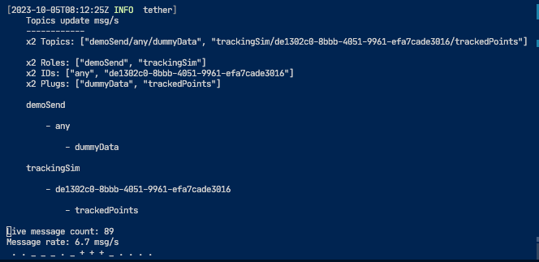

# Tether CLI Utilities

Utilities for [Tether](https://github.com/RandomStudio/tether), a standardised MQTT+MessagePack system for inter-process communication.

This is both a **library** (for Tether Agents to use) and **CLI tool** (for development and troubleshooting), written in Rust.

With the CLI tool, users are provided a single binary with subcommands as follows:

- [receive](#receive): Subscribe to all/some messages and attempt to decode them
- [send](#send): Publish a single message with optional custom payload
- [topics](#topics): Subscribe to all/some messages and parse the topic parts such as Agent Role, Agent ID and Channel Name
- [record](#record): Record messages to disk. Useful for simulation, in combination with `playback` below
- [playback](#playback): Playback messages with their original topics and timing, to simulate one or more Agents

The utils are also provided as a library with an API; extensive use of this facility has been made by [tether-egui](https://github.com/RandomStudio/tether-egui) (a
GUI application providing much of the same utility as above, plus more). For example of API usage, see [examples/api.rs](./examples/api.rs) for a quick overview.

## Quick start
Install
```
cargo install tether-utils
```

Monitor messages on all topics:
```
tether receive
```

## More detailed instructions

There are always **two parts** to the CLI command

- The main command `tether`
  - Followed by optional parameters _for general configuration_ such as `--host` or `--loglevel`
- The subcommand `receive`, `send`, `topics`, `record` or `playback`
  - Followed by optional paramaters _relating to the specific subcommand_

### Example

Here's an example of using the `receive` subcommand but specifying some non-default details for the MQTT Broker, and a non-default topic:

```
tether --host 10.0.0.1 --username myUserName --password myPaSsWorD! receive --topic something/something
```

___
## Subcommands

### `tether receive`

- Run with defaults: `tether receive`
- More options can be found using `tether send --help`

___
### `tether send`


- Run with defaults: `tether send`
- More options can be found using `tether send --help`

#### Note on `--message`:

This will be automatically converted into a MessagePack payload if it is valid JSON. You can typically enclose everything in single-quotes, like this:

```
tether send --message '{"foo":[1,2,3]}
tether send --message '[0,1,2]'
tether send --message '{"hello":"world", "arr":[1,2,3]}'
```

Alternatively, escape characters such as `"`, `[`, `]`, `{` and `}`:

```
tether send --message \{\"hello\":\"world\"\,\"arr\":\[1,2,3\]\}
```

___
### `tether topics`

Super useful for seeing which Agents are online, and how message topics are being parsed according to Agent Role, Channel Name and (optional) Agent ID. Now also provides live rate calculations (messages per second) and activity graph as below:



> 💡 This utility can't see into the past (except in the case of retained messages), so keep this in mind for Agents that don't publish frequently.

- Run with defaults: `tether topics`
- More options can be found using `tether topics --help`

___
### `tether record`

- Run with defaults: `tether record`
- More options can be found using `tether record --help`

By default, a file named `recording-00000000.json` (where the numbers are a timestamp) is generated in the current directory.

___
### `tether playback`

- Run with defaults: `tether playback`
- Only emit messages where the topics match a simple string pattern by passing `--topics.filter`
- More options can be found using `tether playback --help`

If you don't specify a file, an included demo file (`demo.json`) will be used instead. **You probably want to specify a path to a real file, in most cases.**

> 💡Tip: loop the playback infinitely by passing `--loops.infinite`
